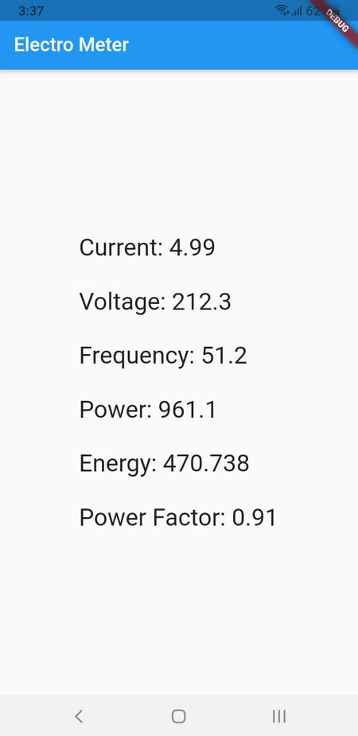

# ElectroMeter

This is an IoT system that senses most of the needed electricity metrics and stores it in firebase to be consumed by a flutter built app.
## Metrics are:
- current
- Voltage
- frequency
- power
- energy

    The project consists of two parts. A Arduino Project that reads data sent from the pzem-004t v3.0 sensor and uploads them to firebase realtime database every second. A flutter app that listens to data in firebase and lists them.

## AC can  Electrocute and possibly KILL YOU!
You need to wire the PZEM to the mains. Please ask Professionals for help.

## Things to keep in mind:
- I choose esp-32 because it has wifi built in and it's cheaper than uno + wifi module.
- esp-32 can't receive 5V signal which the PZEM sends. Thus you need to wire a 1K resistor between esp's RX & PZEM TX.
- there're two versions of the PZEM & the library and they're not cross compatible. V3 is what's sold nowdays.

